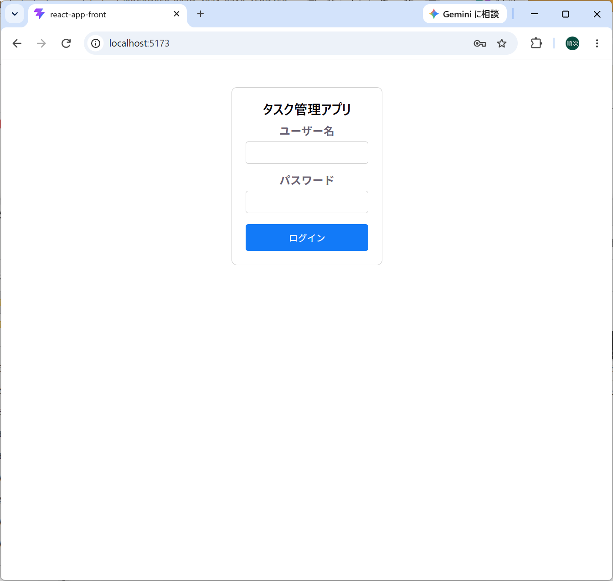
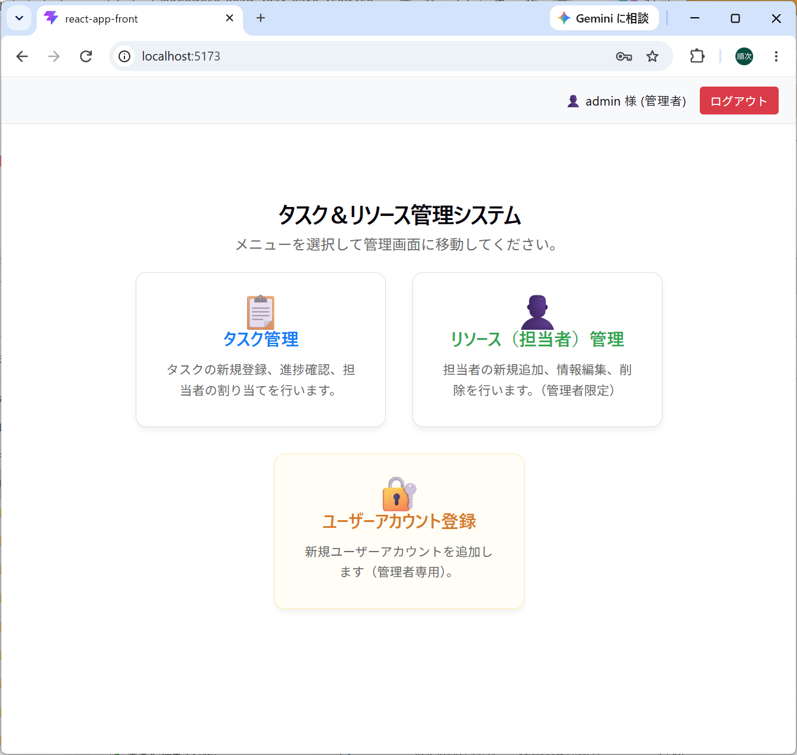
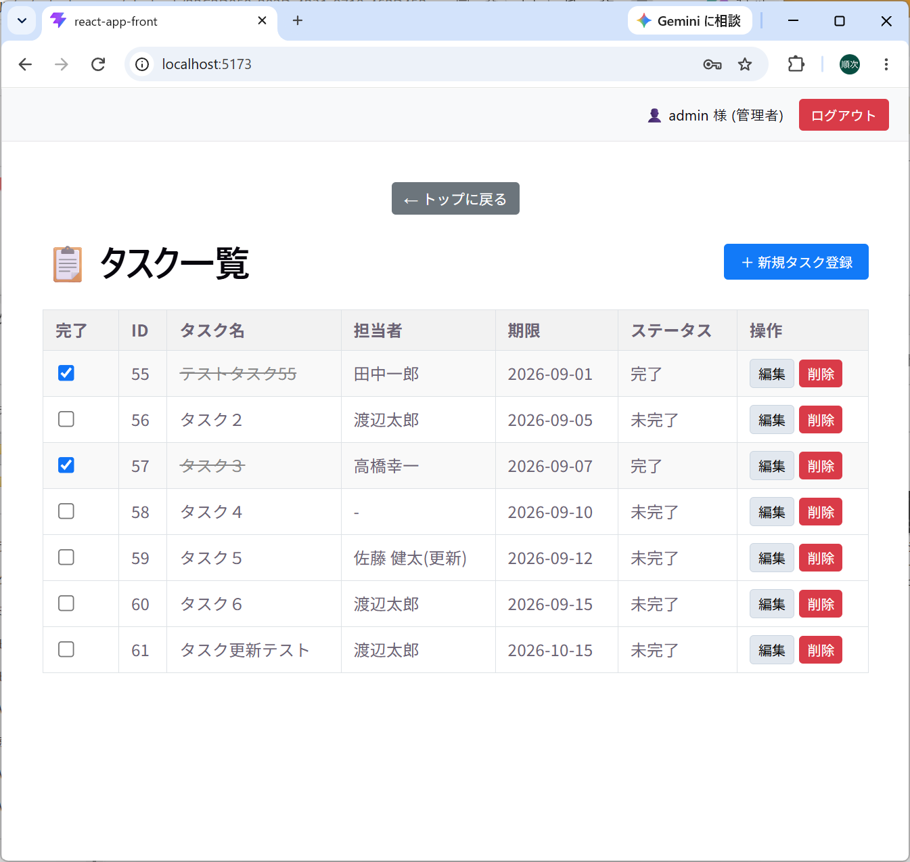
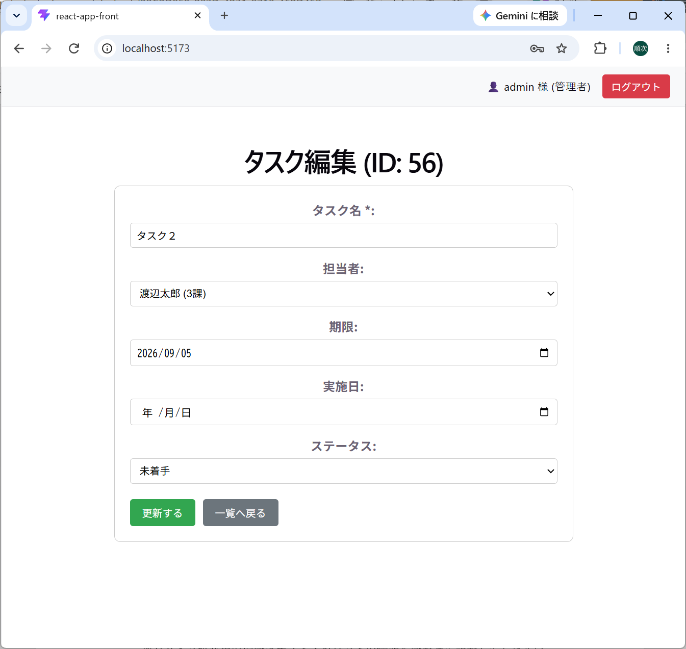
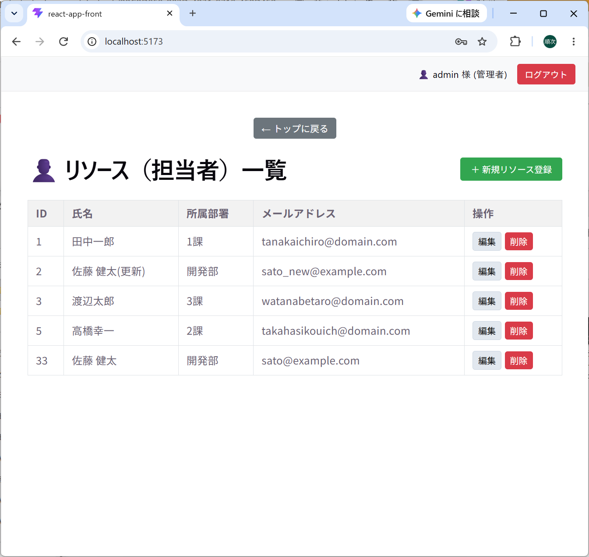
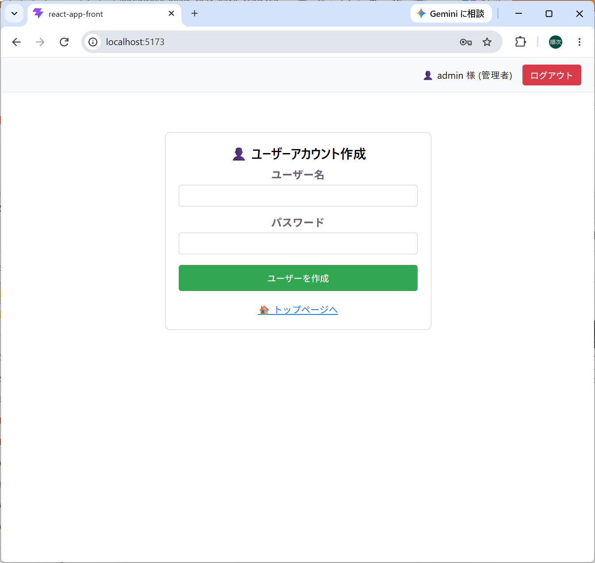
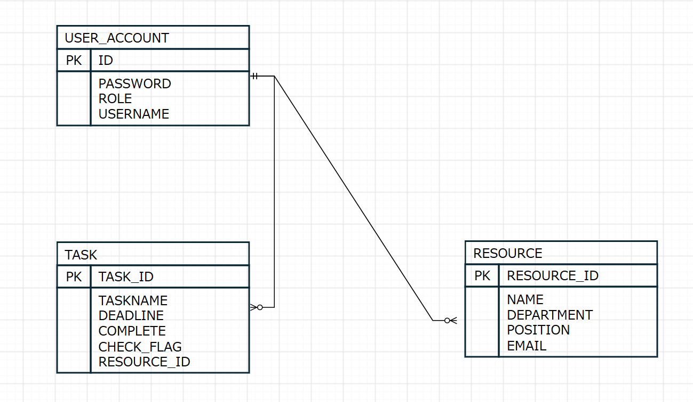

## タスク・リソース管理アプリケーション (Task & Resource Management App)

本アプリケーションは、プロジェクトマネージャとメンバによるプロジェクトのタスクとリソースの管理を簡易的に行える環境を提供するものです。
本アプリケーションは、あまり規模は大きくないが、複数メンバーで役割分担をしながら業務を進めていく場合などに利用できる、簡易的なタスク、リソース管理システムです。

---
## アプリケーションの概要
アプリケーション全体、リソースの管理は管理者が行い、メンバーはタスクの状況を記入していく形になっています。
通常業務の中で、タスクやリソース管理が必要な場合の一助になるようなアプリケーションとして開発しました。
皆様の日常業務の効率化の一助となれば幸いです。

---
## 基本画面・機能説明
本アプリケーションは以下のような画面に情報を入力してタスク、リソースを管理していきます。管理者権限の画面の表示は一部省略しています。
### テスト用ログイン名、パスワードは以下の通りです。
管理者：

　ログイン名　admin

　パスワード admin123

一般ユーザ：

　ログイン名　user01

　パスワード　user01

以下に画面サンプルを示します。

### ログイン画面


アプリケーションへのログイン画面です

### トップ画面


アプリのトップ画面です。一般ユーザーはタスク一覧のみにアクセス可能です。管理者はすべての作業が可能です。

### タスク一覧画面


タスク一覧画面です。一般ユーザーはタスクの完了チェックと、編集画面へ移ることが可能です。管理者はタスクの新規登録、削除も可能です。

### タスク編集画面


タスクの編集画面です。一般ユーザーはタスクの完了日とステイタスの変更が可能です。管理者はすべての作業が可能です。

### リソース一覧画面


リソース一覧画面です。管理者のみがアクセス可能です。管理者は既存のリソースの修正、削除、新規リソースの登録が可能です。


### ユーザー登録画面


ユーザー登録画面です。管理者のみがアクセス可能です。一般ユーザー権限者の登録のみ可能です。


---
## 使用技術 (Tech Stack)
### バックエンド (Backend)
- **Java**
- **Spring Boot**
- **H2 Database**
- **Spring Security** (Basic認証)

### フロントエンド (Frontend)
- **React** (Vite)
- **JavaScript (JSX)**
- **CSS3**

### インフラ・環境 (Infrastructure)
- **Docker / Docker Compose**

---
## ER図


## プロジェクト構成
```text
task-management-app/
├── frontend/          # Reactフロントエンド (Vite)
│   ├── src/           # コンポーネントおよび各CSSファイル
│   └── package.json
├── src/main/          # Spring Bootバックエンド (Java)
├── Dockerfile         # Dockerビルド設定
└── pom.xml            # Maven依存関係管理
```
---


## セットアップ手順 (Getting Started)
このプロジェクトをローカル環境で動作させるための手順です。

### 前提条件
Windows環境
Git（リポジトリのクローン用）
Java (JDK 17以上推奨)
Node.js & npm (Reactのビルド・実行用)
Docker & Docker Compose (コンテナで動かす場合)

###  ローカル環境で起動する
#### 1. リポジトリのクローン
git clone [https://github.com/00junjihgm-bot/task-management-app.git](https://github.com/00junjihgm-bot/task-management-app.git)

cd task-management-app

#### 2. バックエンド (Spring Boot) の起動
プロジェクトのルートディレクトリから、以下のコマンドを実行します。

mvnw.cmd spring-boot:run

#### 3. フロントエンド (React) の起動
新しいターミナルを開き、以下のようにfrontend フォルダに移動して依存関係のインストールと起動を行います。

cd frontend

npm install

npm run dev

※フロントエンドは通常 http://localhost:5173 で起動し、ブラウザでアクセスできます。


